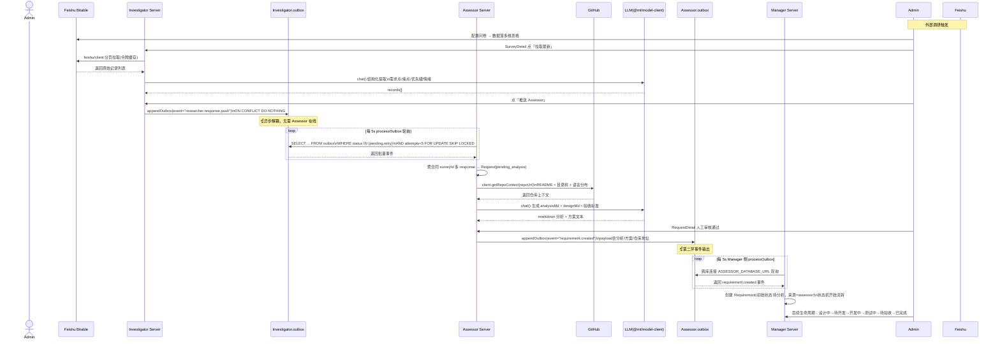
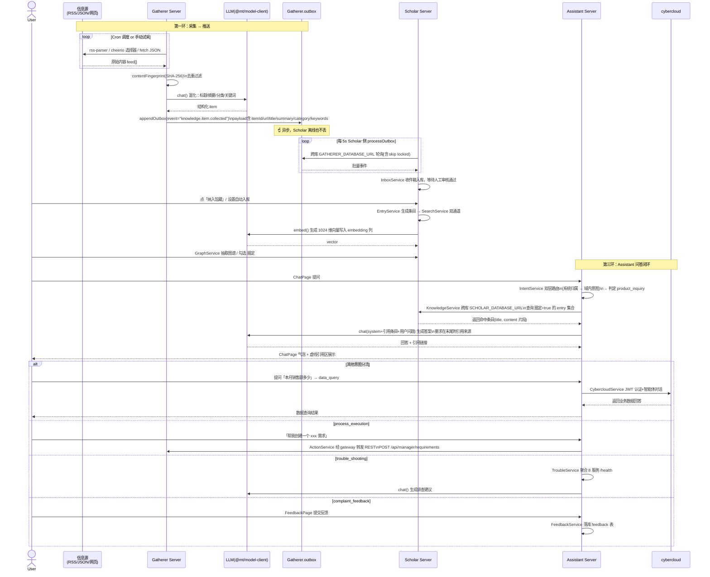

# 服务间通信与事件契约

> 文档状态：当前模块事实源快照（2026-09-15）。源码级功能与接口索引以 `docs/generated/` 为准；本文件用于理解模块结构、边界和实现方式。

## 7. 服务间通信与事件契约

### 7.1 通信模型

```
同步 REST：适合同一子项目内 web → server（经 gateway 反代）
          如 assistant → scholar（SCHOLAR_DATABASE_URL 直连也可）

outbox 事件表：适合跨子项目异步解耦（失败重试 + dead 终态）
  生产者：appendOutbox(pool, { id:event-uuid, event:"xxx", source, payload, occurredAt })
  消费者：setInterval(() => processOutbox(pool, handler, { batchSize:10, maxAttempts:5 }), 5000)
          （每 5 秒轮询一次，SKIP LOCKED 避免并发重复）

幂等键：@mt/utils.idempotencyKey(prefix)，outbox ON CONFLICT DO NOTHING
        消费者可根据事件 id 建立本地去重表
```

### 7.2 三大核心事件契约（跨库直连 processOutbox）

#### ① researcher.response.push（Investigator → Assessor）

```
方向：investigator.outbox → assessor 跨库连接 INVESTIGATOR_DATABASE_URL
触发：Investigator 管理员在 SurveyDetail 点「推送 Assessor」
payload：{
  surveyId, responseId,
  records: [{ question, answer, priority, sentiment, painPoint, expectation }]  // LLM 结构化提取
}
Assessor 消费：批次聚合同 surveyId 的多 response → 生成 Request + 状态 pending_analysis
```

#### ② requirement.created（Assessor → Manager）

```
方向：assessor.outbox → manager 跨库连接 ASSESSOR_DATABASE_URL
触发：Assessor RequestDetail 审核通过 → Push Manager
payload：{
  requestId,
  title, requirement,
  analysisMd,   // LLM 需求分析
  designMd,     // LLM 设计方案
  repoUrl,      // 关联 GitHub 仓库
  reviewComment // 人工审核备注
}
Manager 消费：创建 Requirement（来源=assessor），初始状态待分析
```

#### ③ knowledge.item.collected（Gatherer → Scholar）

```
方向：gatherer.outbox → scholar 跨库连接 GATHERER_DATABASE_URL
触发：Gatherer Item 列表「推送 Scholar」或 Cron 自动审核通过
payload：{
  itemId, url, title, content, summary,
  category, keywords: string[],
  publishedAt
}
Scholar 消费：进入收件箱（InboxService），等待人工审核或自动入库为 Entry
```

### 7.3 需求主线时序图（Mermaid）



### 7.4 知识主线时序图（Mermaid）



---
