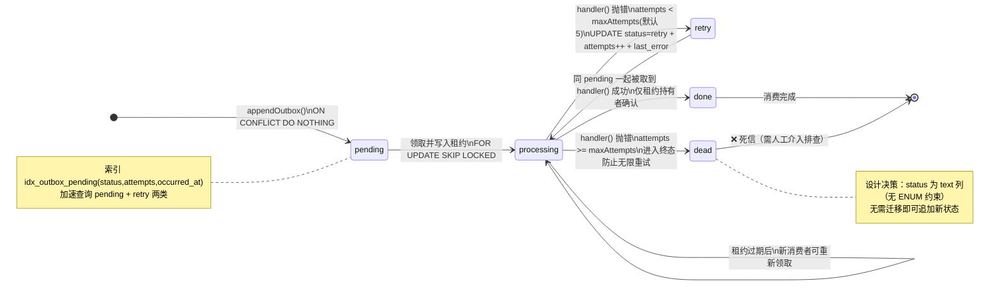

# 公共包参考

> 文档状态：当前模块事实源快照（2026-09-15）。源码级功能与接口索引以 `docs/generated/` 为准；本文件用于理解模块结构、边界和实现方式。

## 4. 公共包（packages/）参考

### 4.1 @mt/config — 配置加载器

- **包路径**：[packages/config](../../packages/config)
- **依赖**：yaml ^2.5, zod ^3.23, dotenv ^16.4
- **版本**：0.0.0

#### 关键函数

| 函数 | 签名 | 说明 |
|---|---|---|
| `findRootEnvFile` | `(startDir: string) => string \| null` | 从 startDir 向上最多 10 层查找仓库根 `.env` |
| `loadRootEnv` | `(startDir?: string) => void` | 找到 .env 后调用 dotenv.config() 注入 process.env；找不到静默 |
| `loadYamlFile` | `(path: string) => unknown` | 同步读取 YAML 文件并 parse（用于 ports.yaml） |
| `resolveEnvOverrides` | `(base, prefix: string) => Record` | 用 `process.env` 中前缀匹配的键覆盖 base 对象 |
| `validateConfig` | `<T>(schema: ZodType, value) => z.infer<T>` | Zod schema 校验，失败抛错（含字段错误信息） |

#### 使用模式

子项目 server `main.ts` 启动时第一行调用：

```ts
import { loadRootEnv } from "@mt/config";
loadRootEnv();
```

保证 `pnpm --filter xxx dev` 在子目录执行时仍能读到仓库根的 .env。

---

### 4.2 @mt/types — 跨前后端共享类型

- **包路径**：[packages/types](../../packages/types)
- **无外部依赖**

#### 关键类型与常量

```ts
// 8 子项目 ID 枚举（PROJECT_IDS 为 const 数组，ProjectId 为推导联合类型）
export const PROJECT_IDS = ["gatherer","investigator","assessor","manager","designer","scholar","assistant","applicant"] as const;
export type ProjectId = typeof PROJECT_IDS[number];

// outbox 事件通用信封（跨子项目数据契约）
export interface DataEnvelope<T> {
  id: string;          // 幂等键（@mt/utils idempotencyKey 生成）
  event: string;       // 事件名：见第 7 节事件契约
  source: ProjectId;   // 产生事件的子项目
  payload: T;          // 事件负载（各事件类型化定义）
  occurredAt: string;  // ISO 时间戳
}

// API 响应通用包裹
export interface ApiResponse<T> {
  code: number;
  message: string;
  data: T;
}
```

---

### 4.3 @mt/utils — 通用工具

- **包路径**：[packages/utils](../../packages/utils)
- **无外部依赖**

#### 关键函数

| 函数 | 签名 | 说明 |
|---|---|---|
| `idempotencyKey` | `(prefix: string) => string` | 生成 `"<prefix>-<UUID>"` 格式幂等键，用于 outbox 事件 |
| `contentFingerprint` | `(text: string) => string` | SHA-256 取前 32 位十六进制，用于 gatherer 去重 |
| `formatDate` | `(d: Date) => string` | ISO 日期 YYYY-MM-DD 格式 |

---

### 4.4 @mt/db — 数据库核心

- **包路径**：[packages/db](../../packages/db)
- **依赖**：pg ^8.12, @mt/types (workspace:*)
- **内置迁移**：migrations/001_outbox.sql

#### 关键函数

| 函数 | 所在文件 | 签名 | 说明 |
|---|---|---|---|
| `createPool` | [pool.ts](../../packages/db/src/pool.ts) | `(connectionString: string) => Pool` | 创建 PG 连接池（max=5），单例由子项目 db.ts 持有 |
| `runMigrations` | [migrations.ts](../../packages/db/src/migrations.ts) | `(pool: Pool, dir: string) => Promise<void>` | 读取 dir 下 `*.sql` 按文件名升序执行，`schema_migrations` 表去重，事务包裹单文件，失败回滚 |
| `appendOutbox` | [outbox.ts](../../packages/db/src/outbox.ts) | `(pool, event: DataEnvelope) => Promise<void>` | 向 outbox 表插入事件，`ON CONFLICT (id) DO NOTHING` 实现幂等 |
| `processOutbox` | [outbox.ts](../../packages/db/src/outbox.ts) | `(pool, handler, options?) => Promise<number>` | 逐事件领取 pending/retry/过期 processing 事件，写入 processing 租约并递增尝试次数后执行 handler；成功 → done，失败释放租约，达到 maxAttempts（默认 5）→ dead；过期且次数已满的 processing 行领取前直接 dead |
| `processOutboxBatch` | [outbox.ts](../../packages/db/src/outbox.ts) | `(pool, batchHandler, options?) => Promise<number>` | 按批领取并传给业务 handler；业务副作用成功后整批确认 done，失败整批释放租约并 retry/dead |

#### outbox 表结构（001_outbox.sql）

| 列 | 类型 | 说明 |
|---|---|---|
| id | text PK | 幂等键 |
| event | text NOT NULL | 事件名 |
| source | text NOT NULL | 来源子项目 |
| payload | jsonb NOT NULL | 数据负载 |
| occurred_at | timestamptz NOT NULL | 发生时间 |
| status | text NOT NULL | pending / retry / done / dead |
| attempts | integer DEFAULT 0 | 已尝试次数 |
| last_error | text | 最近错误信息（最多 500 字符） |
| processed_at | timestamptz | 处理完成时间 |
| locked_by | text | 当前租约持有者 |
| lease_expires_at | timestamptz | 租约过期时间；过期 processing 可被回收 |
| 索引 | idx_outbox_pending(status, attempts, occurred_at) | 加速待处理查询 |

#### outbox 事件生命周期状态机图（Mermaid）



---

### 4.5 @mt/model-client — LLM 统一抽象层

- **包路径**：[packages/model-client](../../packages/model-client)
- **无运行时外部依赖**（纯 fetch API）

#### 4.5.1 核心接口 ModelClient

```ts
export interface ModelClient {
  chat(messages: ChatMessage[], options?: ChatOptions): Promise<{ content: string; usage: UsageLog }>;
  embed(texts: string[]): Promise<number[][]>;
}
```

#### 4.5.2 内置供应商

| 常量 | name | baseUrl | 默认模型 | 视觉模型 | Embedding 模型 |
|---|---|---|---|---|---|
| `DEEPSEEK` | deepseek | api.deepseek.com/v1 | deepseek-chat | — | — |
| `ZHIPU` | zhipu | open.bigmodel.cn/api/paas/v4 | glm-4-flash | glm-4v-flash | embedding-2 |

> 供应商通过 `ModelProviderConfig` 注册，可扩展任意 OpenAI 兼容协议服务。

#### 4.5.3 关键函数

| 函数 | 签名 | 说明 |
|---|---|---|
| `createModelClient` | `(provider, logUsage?) => ModelClient` | 创建客户端；chat 含 3 次重试（429/5xx 指数退避 500ms/1s），可 stream |
| `chatStream` | `async generator (provider, messages, options?, logUsage?)` | SSE 流式逐 token yield，SSE 结束时回调 logUsage |
| **`parseJson`** | `(raw: string) => unknown` | **⭐ LLM 输出容错 JSON 解析（禁止子项目裸 JSON.parse）**：4 级降级 — ① quoteKeys 补引号 → ② 剥离 `` ```json `` ``` 代码围栏 → ③ 正则提取首个 `{...}` 块 → ④ 抛错。兼容无引号键、夹杂文字、代码围栏等常见 LLM 脏输出 |

#### 4.5.4 类型定义

```ts
ChatMessage = { role: "system"|"user"|"assistant", content: string | ContentPart[] }
// ContentPart 支持多模态：{ type:"text", text } | { type:"image_url", image_url:{url} }

ChatOptions = { model?, temperature? (默认 0.3), maxTokens? (默认 2048), stream?, vision? }

UsageLog = { provider, model, inputTokens, outputTokens, ms }
```

---

### 4.6 @mt/ui — 前端设计系统

- **包路径**：[packages/ui](../../packages/ui)
- **peer 依赖**：React 18, AntD 5（无直接依赖，由子项目 web 提供）

#### 4.6.1 设计令牌 tokens

文件：[tokens.ts](../../packages/ui/src/tokens.ts) — **颜色唯一来源，禁止硬编码色值**

| 类别 | 键 | 值 |
|---|---|---|
| 主色/成功/警告/错误/信息 | primary / success / warning / error / info | #2c4a6e / #3a7049 / #9a6a25 / #943d35 / #3a5f84 |
| 文本 | text / textSecondary | #1c2530 / #5f6c7c |
| 背景 | bgLayout / bgContainer / bgNeutral / bgActive / bgUser | #f4f6f8 / #ffffff / #eceef1 / #e3eaf2 / #eef1f5 |
| 边框/兼容扩展 | border / purple / cyan | #d9dde3 / #3a5f84 / #4a8a5d |
| 间距 | xs/sm/md/lg/xl | 4/8/16/24/32 |
| 字号 | sm/md/lg/xl | 12/14/16/20 |
| 圆角 | radius | 6 |

除上表兼容键外，v2.1+ 扩展 `scale`、`dark`、`admin`、`shadow`、`craft`、`motion`、`size` 与 `font`；扩展块仍以 tokens.ts 为唯一事实源，本节不复制全量色阶。

#### 4.6.2 主题提供者

```tsx
// main.tsx 最外层必须包裹
<MtThemeProvider>
  <BrowserRouter basename="/<name>">
    <App />
  </BrowserRouter>
</MtThemeProvider>
```

内部将 tokens 注入 AntD `ConfigProvider`（colorPrimary/borderRadius/fontSize 等）。

#### 4.6.3 三外壳体系

| 外壳 | 组件 | 设计语言 | 适用场景 |
|---|---|---|---|
| **用户前台** | `UserShell` | 每应用独立主题，默认杂志风 | 终端用户消费型页面（浏览/阅读/对话） |
| **配置后台** | `AdminShell` | 全平台统一控制台风（深色侧栏 #1c1f26 + 蓝 accent #4c7dff） | 管理员增删改查/配置页面 |
| **过渡外壳** | `AppShell` | 侧栏 + 顶栏 + 跨应用切换（默认 tokens） | 单一形态无前后台之分的应用 |

#### UserShell 核心 Props

```ts
interface UserShellProps {
  title: string; subtitle?: string;
  navItems: UserNavItem[]; selectedKey: string;
  onNavigate: (key) => void;
  adminPath?: string; adminLabel?: string;  // 页脚「去后台」入口
  footerNote?: string;                       // 个性化页脚文字
  theme?: UserShellTheme;                    // 主题定制（6 字段）
  children: ReactNode;
}
// 默认主题 MAGAZINE_THEME：Georgia/Noto Serif SC + 暖纸 #f8f5ef + 砖红 #b4532a
```

#### AdminShell 核心 Props

```ts
interface AdminShellProps {
  title: string; navItems: AdminNavItem[]; selectedKey: string;
  onNavigate: (key) => void;
  frontPath?: string; frontLabel?: string;  // 侧栏底部「返回前台」（无前台形态 omit）
  eyebrow?: string;                         // 侧栏 eyebrow（mono 短名，如 SCHOLAR · CONTROL）；缺省 ADMIN CONSOLE
  children: ReactNode;
}
```

#### 4.6.4 应用注册表 APPS

```ts
// 外壳顶栏「切换应用」下拉数据源
export const APPS: AppEntry[] = [
  { key:"applicant", label:"求职",    path:"/applicant" },
  { key:"investigator", label:"调研", path:"/investigator" },
  { key:"assessor", label:"评审",     path:"/assessor" },
  { key:"manager", label:"管理",      path:"/manager" },
  { key:"gatherer", label:"采集",     path:"/gatherer" },
  { key:"scholar", label:"知识",      path:"/scholar" },
  { key:"assistant", label:"助手",    path:"/assistant" },
  { key:"designer", label:"设计",     path:"/designer" },
];
```

#### 4.6.5 空态组件

```tsx
<MtEmptyState title="暂无数据" description="可以通过右上角按钮添加第一条" actionText="新建" onAction={() => openModal()} />
```

> 空数据场景强制使用，禁止页面空空白白。

---
