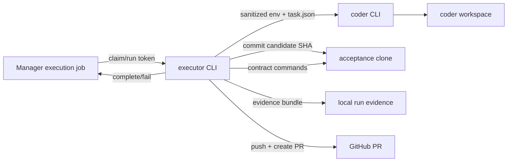

# P23 隔离编码执行器与独立验收设计（当前设计基线）

## 背景

P22 已经提供 execution job/run、owner 显式排队、executor token、一次性 run token、心跳、租约回写和过期恢复，但没有启动编码进程。P23 在 Manager 外新增执行器 CLI，把已批准的执行契约变成一次可审计的开发运行。

## 目标

1. 执行器通过 Manager API 原子领取任务，并在运行期间持续心跳。
2. 每次运行使用独立目录：编码工作区、隔离 HOME 和证据目录互不污染。
3. 编码 CLI 只收到白名单环境变量和任务文件，拿不到 Manager、GitHub、生产模型和部署秘密。
4. 编码产物必须先提交为候选 SHA，并验证所有改动都在契约允许路径内。
5. 验收命令不在编码工作区执行；执行器从候选 SHA 克隆出独立验收工作区后运行全部契约命令。
6. 超时终止整个进程树，stdout/stderr 和环境键名保留为诊断证据。
7. 验收通过后由执行器推送候选分支并创建 PR；PR body 记录候选 SHA、命令结果和证据摘要。
8. 成功或失败都回写 Manager；回写错误文本经过脱敏并限制长度。

## 非目标

- 不在本批实现通知、验收面板或自动合并，留给 P24/P25。
- 不把 LLM 客户端嵌入 Manager；编码 CLI 由运行方显式配置，便于接入 Codex 或其它 agent。
- 不宣称操作系统级强沙箱。本批保证秘密不进入编码进程、工作区和 Git 配置隔离；对抗恶意进程需要后续容器/VM 边界。
- 不绕过 GitHub 分支保护；PR 创建后仍需现有 quality/smoke/e2e 检查。

## 架构

新增基础设施模块：

- `infra/scripts/lib/executor-process.mjs`：白名单环境、无 shell 子进程、输出截断、进程树终止。
- `infra/scripts/lib/executor-workspace.mjs`：克隆、任务文件、候选提交、路径边界、独立验收工作区。
- `infra/scripts/lib/executor-manager.mjs`：claim/heartbeat/complete/fail API 客户端。
- `infra/scripts/lib/executor-github.mjs`：分支 SHA、Open PR 查询与创建。
- `infra/scripts/executor.mjs`：一次性/循环执行 CLI。

Manager 的 claim 响应补充只读需求上下文（标题、描述、范围和验收标准），避免执行器再用另一条身份读取需求。

## 运行流程

1. 读取配置并验证 Manager/GitHub 凭证、编码命令和输出目录；配置不完整时不领取任务。
2. 领取 job，得到 run token、契约和需求上下文。
3. 解析目标 base 分支 SHA，克隆到本次运行的 coder workspace。
4. 写入 `task.json`，创建隔离 HOME 和空 Git 配置，运行编码 CLI。
5. 拒绝空提交、符号链接、越界路径和超大文件，提交剩余改动并记录候选 SHA。
6. 从本地候选 SHA 克隆独立验收工作区，按顺序运行契约验收命令。
7. 生成本地 `evidence.json` 与日志文件，记录 SHA256、时长、退出码、输出摘要和环境键名。
8. 推送候选分支，复用或创建 PR，回写 Manager 成功结果。
9. 任一步失败则保存诊断，调用 fail API；心跳失败时立即停止本地进程并保留证据。

## 配置

| 变量 | 说明 |
|---|---|
| `MT_EXECUTOR_MANAGER_URL` | Manager API base，例如 `http://127.0.0.1:5004/api/manager` |
| `MT_EXECUTOR_MANAGER_TOKEN` | 与 `MANAGER_EXECUTOR_TOKEN` 对应 |
| `MT_EXECUTOR_GITHUB_TOKEN` | 仅执行器进程可见，用于克隆、推送和创建 PR |
| `MT_EXECUTOR_CODER_COMMAND` | JSON 字符串数组，无 shell 执行 |
| `MT_EXECUTOR_WORKSPACE_ROOT` | 运行目录，默认 `.executor-runs` |
| `MT_EXECUTOR_BASE_BRANCH` | 默认 `main` |
| `MT_EXECUTOR_ONCE` | `1` 时只处理一个任务 |

## 验收

- 白名单环境测试证明敏感变量不会传给编码/验收进程。
- 超时测试证明子孙进程一起退出且诊断保留。
- 本地 Git 集成测试证明候选 SHA、独立验收工作区和路径边界有效。
- 编排测试证明成功回写 PR 结果、越界改动回写失败且不发布。
- Manager 真实数据库用例补充 claim 响应需求上下文断言。
- live coder/GitHub 生产运行在未提供外部凭证时明确 `not-run`。
